# WGRALGO Investment Portfolio Builder

Investment Portfolio Builder is a free educational Android app from **The Wealth Gap Resolution Algorithm™ Inc.** Ride 40 years of real-world market ups and downs, then plan your own investing future with honest numbers, including fees, employer match, and inflation.

No subscriptions, ads, accounts, trackers, or cloud uploads. The projections are for educational and informational purposes only. They are not financial, legal, tax, investment, or lending advice.

- **Version:** 2.0.0
- **Devices:** phones and tablets, portrait and landscape
- **Package:** `org.wgralgo.investmentportfoliobuilder`
- **License:** GPL-3.0-only

## Features

- **🎢 Market Rollercoaster (the game).** You're 25 and invest $200 a month until 65. Pick how you invest (target-date fund, stock/bond mixes, a savings account, or one hot stock), then make real decisions through market crashes, hot tips, fees, and raises. Every game has different market years.
- **Compare yourself** with Steady Sam (same portfolio, never panics) and Diversified Dana (a simple target-date index fund), on a 40-year chart with market crashes marked.
- **Investor Behavior Score** with feedback on every decision and lessons to take with you.
- **🧮 My Investing Plan (the calculator).** Choose a portfolio mix, your age, retirement age, starting amount, monthly contribution, yearly raise, employer match, and fees. See bad-luck, typical, and good-luck outcomes from 2,000 simulated futures, in today's dollars too, plus what you put in, what your employer added, fees paid, and a year-by-year table.
- **Looks like a real app:** black launch screen with the big logo, a launcher icon that fills round, squircle, and square shapes, a solid app bar, About / Privacy / Credits panels, and Android back-button support (back returns from the planner to the game, asks before quitting a game, returns to the start from results, and asks before exiting the app).
- **Phones and tablets, portrait and landscape:** the app rotates freely. On phones turned sideways the start-screen logo is smaller so the game starts on screen; on tablets the dashboard and results spread into more columns.
- Offline-first: no `INTERNET` permission, no account, no cloud.

## Screenshots

| Launch | Home | Market crash | Feedback |
|------|---------|-----------------|------|
| 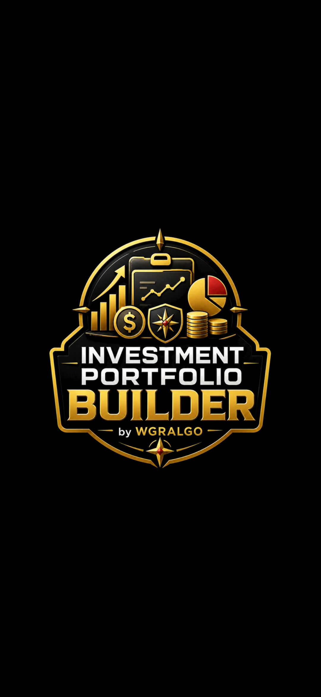 | 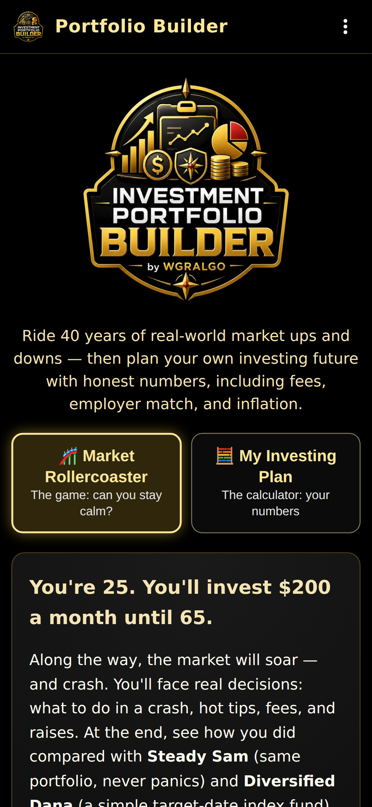 | 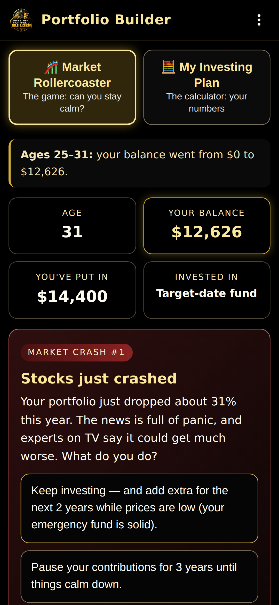 | 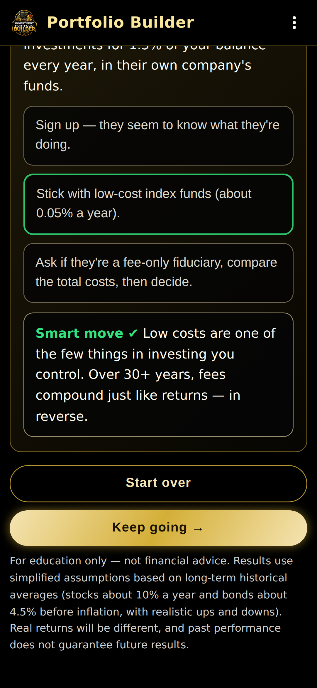 |

| Results | Planner | Menu | About |
|---------|--------------|--------------|------|
| 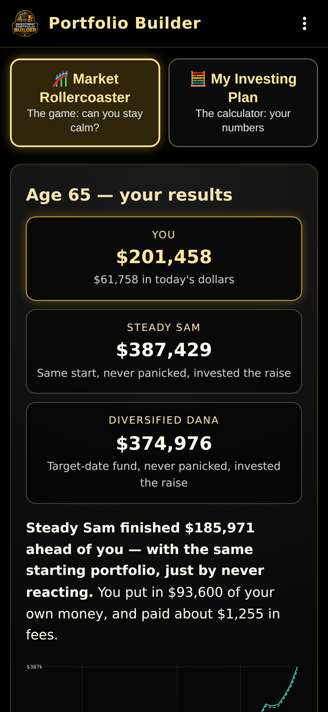 | 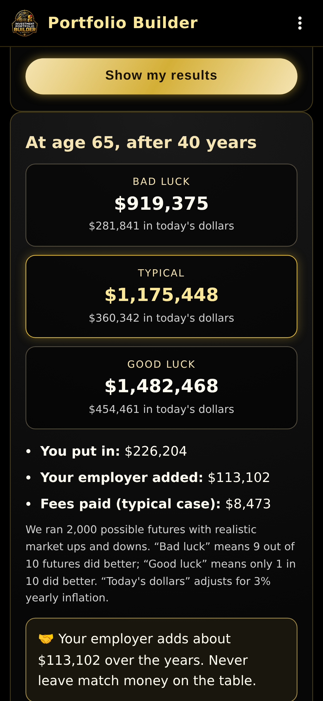 | 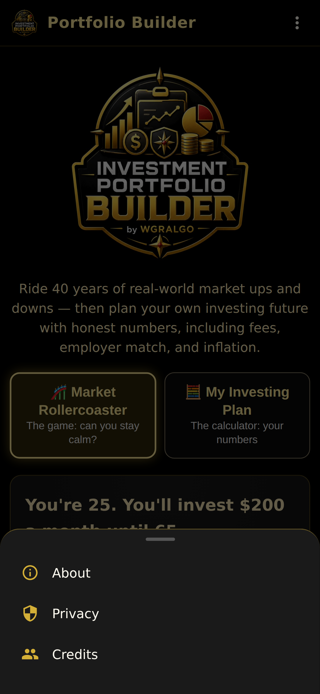 | 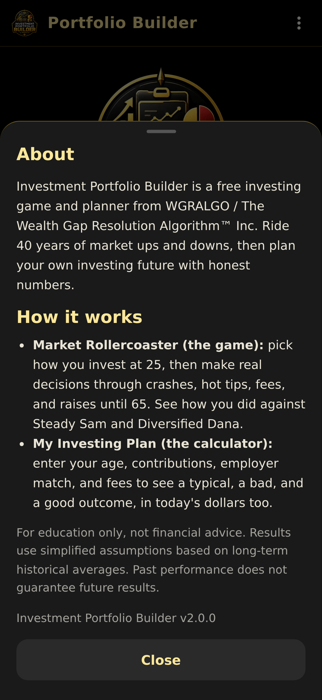 |

Phones and tablets:

| Phone, landscape | Tablet, landscape | Tablet, portrait |
|---|---|---|
| 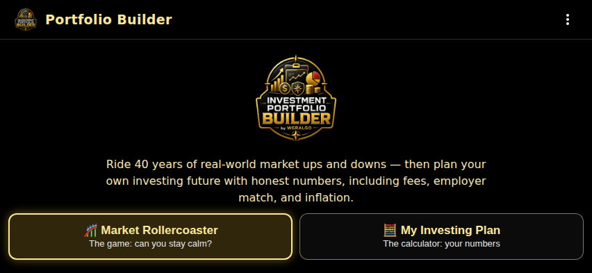 | 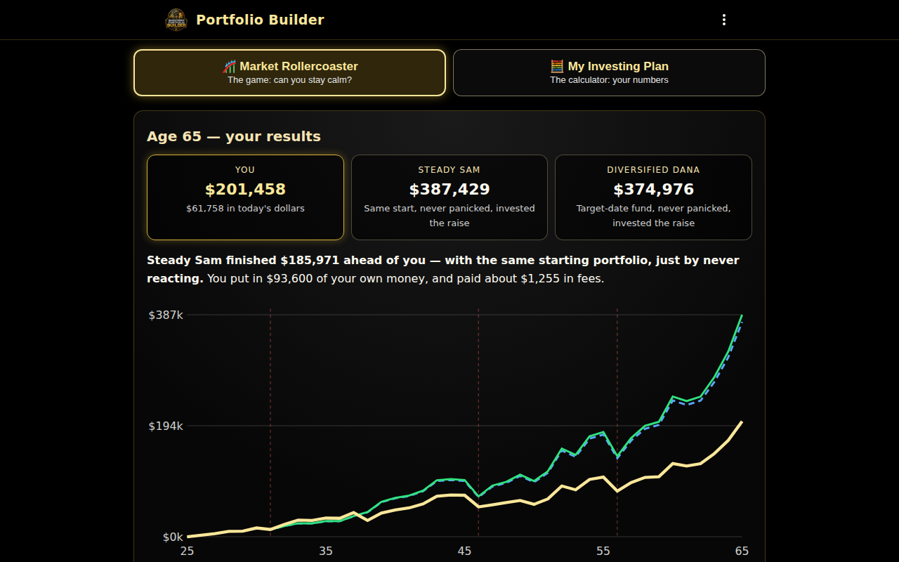 | 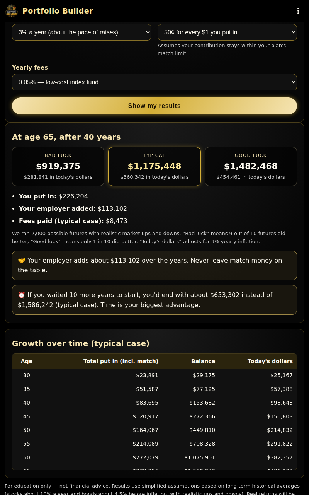 |

## Privacy & Offline

WGRALGO Investment Portfolio Builder is offline-first.

- No ads.
- No account.
- No analytics.
- No trackers.
- No subscription.
- No cloud sync and no backend server.
- All inputs stay on your device and nothing is saved after you close the app.
- The APK does **not** request the Android `INTERNET` permission (it is stripped from the final manifest).

See [PRIVACY.md](PRIVACY.md) for the full privacy statement.

## Installation (Sideloading)

1. Download `WGRALGO-InvestmentPortfolioBuilder-v2.0.0.apk` from the [v2.0.0 release](../../releases/tag/v2.0.0).
2. (Optional) Verify the download:
   ```
   sha256sum -c WGRALGO-InvestmentPortfolioBuilder-v2.0.0.apk.sha256
   ```
3. On your Android phone or tablet, allow installation from unknown sources for your browser or file manager.
4. Open the APK and install.

> **Upgrading from v1.0.0?** Version 2.0.0 is signed with a new key, so it can't install over the old app. Uninstall v1.0.0 first, then install v2.0.0. The app saves nothing on your device, so nothing is lost.

Signing certificate (v2.0.0 and later):

- `CN=WGRALGO, OU=Investment Portfolio Builder, O=The Wealth Gap Resolution Algorithm Inc, C=US`
- SHA-256: `3E:BC:B3:17:1E:38:64:2F:DC:F5:B2:0A:B7:34:EC:20:BE:A5:6A:AB:9C:AF:50:82:AA:C3:39:C9:7F:00:CB:C7`

```
apksigner verify --print-certs WGRALGO-InvestmentPortfolioBuilder-v2.0.0.apk
```

## Build from Source

Requirements:
- Node.js 18+
- Android SDK (with build-tools and platforms)
- JDK 17

```
git clone https://github.com/WGRALGO/WGRALGO-Investment-Portfolio-Builder.git
cd WGRALGO-Investment-Portfolio-Builder
npm install
npx cap sync android
cd android
./gradlew assembleRelease
```

A release keystore is required for a signed APK. Reference it via `android/keystore.properties` (never committed):

```
storeFile=/absolute/path/to/your-release.p12
storePassword=YOUR_PASSWORD
keyAlias=portfolio-builder
keyPassword=YOUR_PASSWORD
```

or the env vars `IPB_KEYSTORE_FILE`, `IPB_KEYSTORE_PASSWORD`, `IPB_KEY_ALIAS`, `IPB_KEY_PASSWORD`. The signed APK will be at `android/app/build/outputs/apk/release/app-release.apk`.

Check a build before publishing:

```
bash tools/validate-release.sh android/app/build/outputs/apk/release/app-release.apk
```

The launcher icon, splash images, and in-app logo are generated from `assets/icon.png` with `python3 tools/build-icons.py` (run from the repo root).

## Continuous integration and releases

- [`.github/workflows/android.yml`](.github/workflows/android.yml) builds a debug APK on every push and pull request.
- [`.github/workflows/release.yml`](.github/workflows/release.yml) builds, validates, signs, and publishes `WGRALGO-InvestmentPortfolioBuilder-v<version>.apk` with its `.sha256` to GitHub Releases. Run it from the **Actions** tab or push a `v*` tag. It needs these repository secrets: `IPB_KEYSTORE_BASE64`, `IPB_KEYSTORE_PASSWORD`, `IPB_KEY_ALIAS`, `IPB_KEY_PASSWORD`.

## Disclaimer

These projections are simplified estimates for education only and do not guarantee future investment results. They do not constitute financial, legal, tax, investment, or lending advice, and they do not replace disclosures or official statements.

Real-world results vary based on fees, taxes, market behavior, allocation changes, contribution timing, and many other factors. Always verify important financial decisions using official statements and qualified professionals.

## License

This project is released under the **GNU General Public License v3.0 (GPL-3.0-only)**. See [LICENSE](LICENSE).

Third-party dependencies remain under their own licenses — see [THIRD_PARTY_NOTICES.md](THIRD_PARTY_NOTICES.md).

## Credits

Created and maintained by **WGRALGO / The Wealth Gap Resolution Algorithm™ Inc.**

Project direction, testing, and public release decisions by **Richard "Rich" BlackMan / WGRALGO**.

Original web concept and educational content assistance by **ChatGPT by OpenAI**.

Android APK build, source cleanup, and GitHub packaging assistance by **Claude Code by Anthropic**.

See [CONTRIBUTORS.md](CONTRIBUTORS.md).

## Links

External websites are separate from the APK and may have their own privacy policies. The APK itself contains no external links, social media links, or donation links.

- Project page: https://thewealthgapresolutionalgorithm.org/investment-portfolio-builder/
- Security reports: see [SECURITY.md](SECURITY.md)
