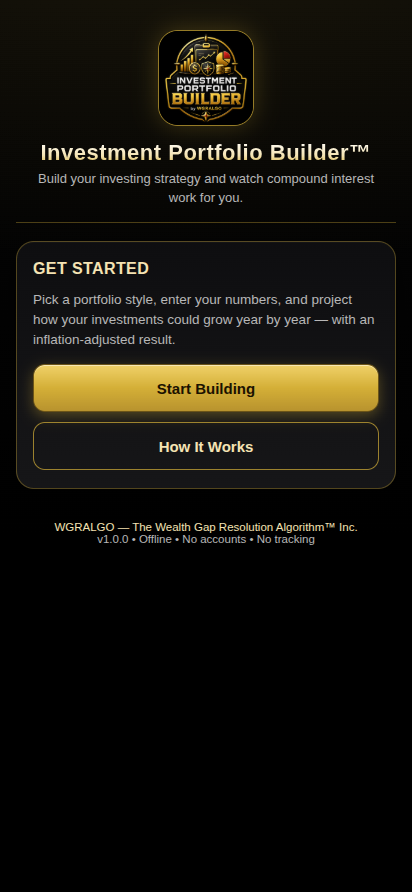
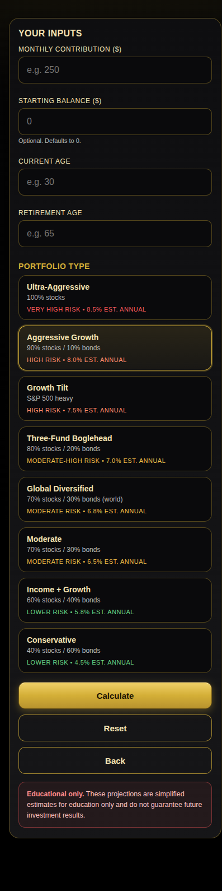
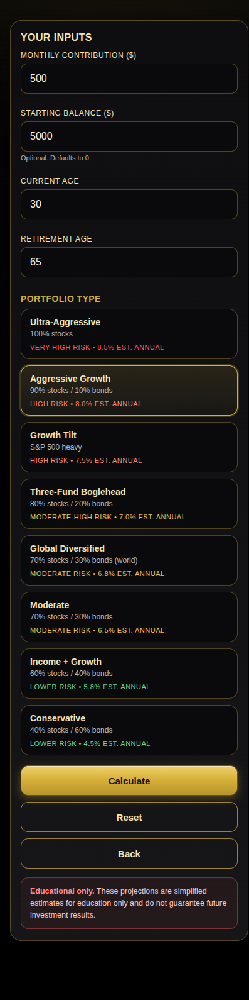
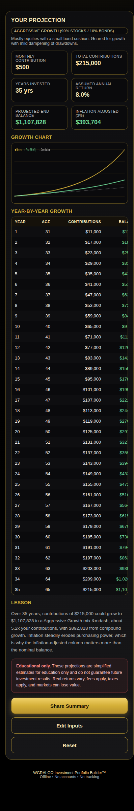
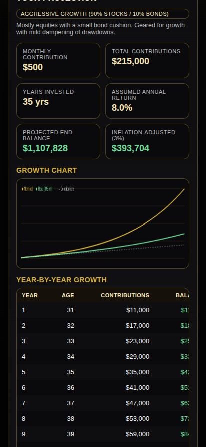
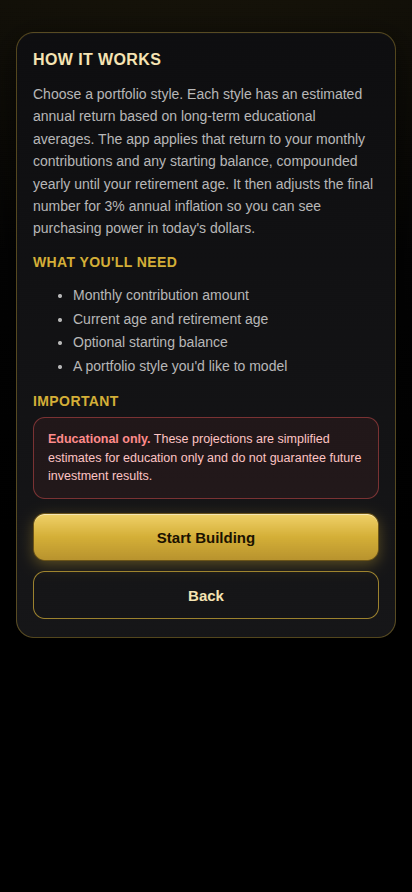

# WGRALGO Investment Portfolio Builder

Investment Portfolio Builder is a free educational Android app from **The Wealth Gap Resolution Algorithm™ Inc.** It helps users explore portfolio types, monthly contributions, compound growth, inflation-adjusted balances, and long-term investing habits.

The app is designed for serious people with limited resources who want to understand how their money could grow — without subscriptions, ads, accounts, trackers, or cloud uploads.

The projections are for educational and informational purposes only. They are not financial, legal, tax, investment, or lending advice.

## Features

- Eight portfolio styles, each with an educational annual-return assumption
  - Ultra-Aggressive — 100% stocks (8.5% est.)
  - Aggressive Growth — 90/10 (8.0% est.)
  - Growth Tilt — S&P 500 heavy (7.5% est.)
  - Three-Fund Boglehead — 80/20 (7.0% est.)
  - Global Diversified — 70/30 world (6.8% est.)
  - Moderate — 70/30 (6.5% est.)
  - Income + Growth — 60/40 (5.8% est.)
  - Conservative — 40/60 (4.5% est.)
- Monthly contribution, current age, retirement age, and optional starting balance inputs
- Year-by-year projection table with age, total contributions, balance, and inflation-adjusted balance
- 3% annual inflation adjustment (real purchasing-power view)
- Visual nominal vs. real growth chart, plus contribution baseline
- Educational portfolio explanations and a per-result money lesson
- Share/copy a plain-text projection summary
- Premium WGRALGO black-and-gold UI, tablet and phone responsive
- Offline-first, no permissions required, no account, no cloud

## Privacy & Offline

WGRALGO Investment Portfolio Builder is offline-first.

- No ads.
- No account.
- No analytics.
- No trackers.
- No subscription.
- No cloud sync and no backend server.
- All inputs stay on your device.
- The APK does **not** request the Android `INTERNET` permission.

See [PRIVACY.md](PRIVACY.md) for the full privacy statement.

## Installation (Sideloading)

1. Download `WGRALGO_Investment_Portfolio_Builder_v1.0.0.apk` from the [v1.0.0 release](../../releases/tag/v1.0.0).
2. (Optional) Verify the download:
   ```
   sha256sum -c WGRALGO_Investment_Portfolio_Builder_v1.0.0.apk.sha256
   ```
3. On your Android device, allow installation from unknown sources for your browser or file manager.
4. Open the APK and install.

> **If you installed an earlier test/debug build:** you may need to **uninstall the old APK first** before installing v1.0.0. The official public APK uses a new proper release signature, and Android will refuse to install over a build signed with a different key.

## Build from Source

Requirements:
- Node.js 18+
- Android SDK (with build-tools and platforms)
- JDK 17

```
git clone https://github.com/WGRALGO/WGRALGO-Investment-Portfolio-Builder.git
cd WGRALGO-Investment-Portfolio-Builder
npm install
npx cap sync android
cd android
./gradlew assembleRelease
```

A release keystore is required for a signed APK. Create one and reference it via `android/keystore.properties`:

```
storeFile=/absolute/path/to/your-release.jks
storePassword=YOUR_PASSWORD
keyAlias=YOUR_ALIAS
keyPassword=YOUR_PASSWORD
```

The signed APK will be at `android/app/build/outputs/apk/release/app-release.apk`.

## Screenshots

| Home | Builder | Portfolio Cards |
|------|---------|-----------------|
|  |  |  |

| Results | Growth Chart | How It Works |
|---------|--------------|--------------|
|  |  |  |

## Disclaimer

These projections are simplified estimates for education only and do not guarantee future investment results. They do not constitute financial, legal, tax, investment, or lending advice, and they do not replace disclosures or official statements.

Real-world results vary based on fees, taxes, market behavior, allocation changes, contribution timing, and many other factors. Always verify important financial decisions using official statements and qualified professionals.

## License

This project is released under the **GNU General Public License v3.0 (GPL-3.0-only)**. See [LICENSE](LICENSE).

Third-party dependencies remain under their own licenses — see [THIRD_PARTY_NOTICES.md](THIRD_PARTY_NOTICES.md).

## Credits

Created and maintained by **WGRALGO / The Wealth Gap Resolution Algorithm™ Inc.**

Project direction, testing, and public release decisions by **Richard "Rich" BlackMan / WGRALGO**.

Original web concept and educational content assistance by **ChatGPT by OpenAI**.

Android APK build, source cleanup, and GitHub packaging assistance by **Claude Code by Anthropic**.

See [CONTRIBUTORS.md](CONTRIBUTORS.md).

## Links

External websites are separate from the APK and may have their own privacy policies. The APK itself contains no external links, social media links, or donation links.

- Project page: https://thewealthgapresolutionalgorithm.org/investment-portfolio-builder/
- Security reports: see [SECURITY.md](SECURITY.md)
